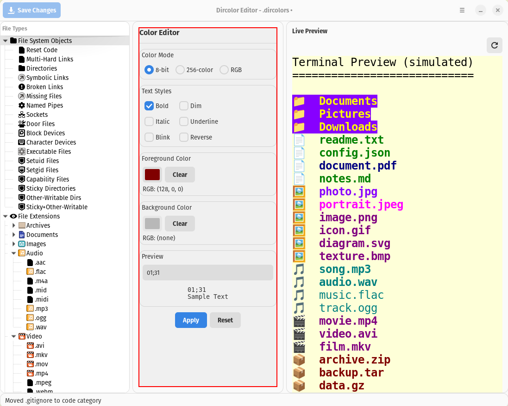

# Dircolor Editor

A modern GTK4 application for editing `.dircolors` files with a visual interface. Easily customize terminal colors for the `ls` command and other color-aware applications.

## Screenshot

<p align="center">
  
</p>

## Features

- **Visual Color Editing**: Use color pickers and style toggles instead of memorizing ANSI codes
- **Live Preview**: See how your colors will look in the terminal in real-time
- **Multiple Color Modes**: Support for 8-bit, 256-color, and RGB/truecolor modes
- **File Type Organization**: Browse file types and extensions in an organized tree view
- **Import/Export**: Load and save `.dircolors` files with proper formatting
- **Pop OS! Integration**: Native GTK4 interface that fits perfectly with your desktop

## Installation

### Prerequisites

Make sure you have the required system packages:

```bash
# Ubuntu/Pop OS!/Debian
sudo apt install python3-gi python3-gi-cairo gir1.2-gtk-4.0 gir1.2-adw-1

# Fedora
sudo dnf install python3-gobject python3-cairo-devel gobject-introspection-devel gtk4-devel libadwaita-devel

# Arch Linux
sudo pacman -S python-gobject python-cairo gtk4 libadwaita
```

### Python Dependencies

Install Python dependencies:

```bash
pip install PyGObject pycairo
```

Or using the requirements file:

```bash
pip install -r requirements.txt
```

## Usage

### Running the Application

```bash
# Easy launcher (recommended)
./launch.sh

# Or run directly
python3 run.py

# Open a specific .dircolors file
python3 run.py /path/to/your/.dircolors
```

**Note:** The application will automatically load your `~/.dircolors` file if it exists.

### Opening a File

The application will automatically load your `~/.dircolors` file if it exists. You can also:

- Use **File → Open** to load a different `.dircolors` file
- Use **File → New** to start with system defaults

### Editing Colors

1. **Select a file type** in the left tree view (directories, extensions, etc.)
2. **Choose colors** using the color picker buttons in the center panel
3. **Toggle text styles** like bold, italic, underline
4. **See the preview** update in real-time on the right panel
5. **Click Apply** to save your changes

### Color Modes

- **8-bit**: Traditional 16-color terminal support
- **256-color**: Extended color palette (most modern terminals)
- **RGB**: Full truecolor support (newer terminals)

### Saving Your Work

- **Ctrl+S** or **File → Save** to save to the current file
- **File → Save As** to save to a new location
- The application creates backups automatically

## File Structure

```
dircolor_editor/
├── src/
│   ├── main.py              # Application entry point
│   ├── parser.py            # .dircolors file parser
│   ├── color_utils.py       # Color conversion utilities
│   └── ui/
│       ├── main_window.py   # Main application window
│       ├── file_type_tree.py# File type tree view
│       ├── color_editor.py  # Color picker/editor
│       └── preview_panel.py # Live preview
├── data/
│   └── default.dircolors    # Default configuration
├── run.py                   # Launcher script
└── test_core.py            # Core functionality tests
```

## Understanding .dircolors

The `.dircolors` file uses ANSI escape sequences to define colors:

- **File types**: `DIR`, `LINK`, `EXEC`, etc.
- **Extensions**: `.txt`, `.jpg`, `.zip`, etc.
- **Color codes**: Format is `STYLE;FOREGROUND;BACKGROUND`
  - Style: `00`=normal, `01`=bold, `04`=underline, etc.
  - Colors: `30-37` (foreground), `40-47` (background)
  - 256-color: `38;5;N` (foreground), `48;5;N` (background)
  - RGB: `38;2;R;G;B` (foreground), `48;2;R;G;B` (background)

## Examples

### Basic Usage

```bash
# Edit your personal dircolors
python3 run.py ~/.dircolors

# Create a new theme
python3 run.py
# File → Save As → mytheme.dircolors
```

### Applying Changes

After editing, apply the new colors to your terminal:

```bash
# Apply temporarily
eval $(dircolors ~/.dircolors)

# Apply permanently (add to ~/.bashrc)
echo 'eval $(dircolors ~/.dircolors)' >> ~/.bashrc
```

## Troubleshooting

### GTK4 Not Found

If you get import errors, make sure you have GTK4 development packages:

```bash
sudo apt install libgtk-4-dev libadwaita-1-dev
```

### Permission Errors

Make sure you have write permissions to your `.dircolors` file:

```bash
chmod 644 ~/.dircolors
```

### Colors Not Showing

Some terminals have limited color support. Try:

1. Using a terminal that supports 256-color or truecolor
2. Setting `TERM=xterm-256color` in your environment
3. Using 8-bit color mode for maximum compatibility

## Development

### Running Tests

```bash
python3 test_core.py
```

### Code Structure

The application uses:
- **GTK4 + Libadwaita** for the user interface
- **PyGObject** for Python GTK bindings
- **Modular design** with separate parser, color utilities, and UI components

### Contributing

1. Fork the repository
2. Create a feature branch
3. Make your changes
4. Test thoroughly
5. Submit a pull request

## License

MIT License - see LICENSE file for details.

## Acknowledgments

- GTK4 and Libadwaita teams for excellent UI frameworks
- GNU coreutils for the `dircolors` utility
- Pop OS! team for desktop environment inspiration